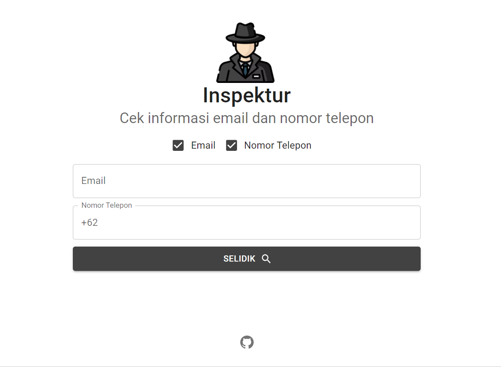

<p align="center"></p>
<h1 align="center">Inspektur</h1>
<h4 align="center">Cari informasi mengenai email dan nomor telepon dengan mudah.</h4>

<p align="center">
  
  
  
</p>

Inspektur adalah aplikasi OSINT yang berguna untuk mencari informasi berdasarkan email dan nomor telepon.

# Fitur
- Mengecek akun yang terdaftar dari [banyak](https://github.com/bagaswastu/inspektur/tree/main/api/holehe/modules) situs berdasarkan email
- Mengecek akun Instagram dan Snapchat berdasarkan nomor telepon
- Mengecek informasi detail akun Telegram
- Mengecek data yang bocor berdasarkan data [HIBP](https://haveibeenpwned.com/)

# Demo

# Daftar Isi
- [Fitur](#fitur)
- [Demo](#demo)
- [Daftar Isi](#daftar-isi)
- [Cara Kerja](#cara-kerja)
- [Catatan](#catatan)
- [Cara Menjalankan Aplikasi](#cara-menjalankan-aplikasi)
  - [Cara mendapatkan file session Telegram](#cara-mendapatkan-file-session-telegram)
  - [Menjalankan aplikasi dengan Docker Compose](#menjalankan-aplikasi-dengan-docker-compose)
  - [Menjakankan aplikasi secara manual](#menjakankan-aplikasi-secara-manual)
- [Kontribusi](#kontribusi)
- [Lisensi & Atribusi](#lisensi--atribusi)


# Cara Kerja
Inspektur akan memeriksa email dan nomor telepon yang diberikan dengan menggunakan teknik _lupa password_. Inspektur juga mengecek informasi mengenai data email yang bocor dan mengambil infromasi akun Telegram dari nomor telepon yang bersangkutan.

Data yang bocor didapatkan dari [Periksa Data](https://periksadata.com) yang merujuk ke [Have I Been Pwned](https://haveibeenpwned.com).
# Catatan
Karena [website Inspektur](inspektur.app.wastu.dev) saat ini tidak menggunakan _proxy_ untuk mengambil data, _rate limit_ mungkin akan terjadi yang menyebabkan kurang maksimalnya data yang dapat diambil, maka dari itu saya menyarankan untuk [menjalankan aplikasi Inspektur sendiri](#cara-menjalankan-aplikasi) jika ingin mendapatkan hasil yang lebih maksimal.


# Cara Menjalankan Aplikasi
Inspektur menggunakan Telegram API agar dapat bekerja, sebelum menjalankan aplikasi kalian harus mendapatkan file session Telegram terlebih dahulu.
## Cara mendapatkan file session Telegram
- Clone repository ini
- Copy `.env.example` ke `.env`
- Ubah `TELEGRAM_API_ID`, `TELEGRAM_API_HASH`, dengan [token akun Telegram](https://core.telegram.org/api)
- Install modul yang dibutuhkan:
    ```bash
    $ python -m venv venv
    $ source venv/bin/activate
    $ pip install -r requirements.txt
    ```
- Jalankan file `telegram.py`
    ```bash
    $ python modules/telegram.py
    ```
- Masukan nomor HP dan lakukan autentikasi sesuai instruksi
- Jika sudah berhasil, maka akan terdapat file `login.session`, upload file ini object storage (Firebase, S3, dll) agar bisa diakses oleh aplikasi 
- Ubah `TELEGRAM_SESSION_URL` dengan URL file `login.session` tadi

## Menjalankan aplikasi dengan Docker Compose
- Pastikan file `.env` sudah terisi semua
- Ubah variabel `API_URL` di `client/src/config.js` dengan `127.0.0.1:5000`
- Jalakan Docker Compose     
    ```bash
    $ docker-compose up
    ```
- Aplikasi client bisa diakses di `localhost:3000` dan API bisa diakses di `localhost:5000`

## Menjakankan aplikasi secara manual
- Clone repository ini
- Ubah variabel `API_URL` di `client/src/config.js` dengan `127.0.0.1:5000`
- Jalankan server client:
    ```bash
    $ cd client
    $ npm install
    $ npm start
    ```
- Jalankan server API:
    ```bash
    $ cd api
    $ python -m venv venv
    $ source venv/bin/activate
    $ pip install -r requirements.txt
    $ python app.py
    ```

# Kontribusi
Kontribusi sangat dibutuhkan untuk aplikasi ini, pull request terbuka untuk umum, tetapi untuk pengubahan fitur silakan buat [issue](https://github.com/bagaswastu/inspektur/issues) terlebih dahulu untuk mendiskusikan apa yang ingin diubah.

# Lisensi & Atribusi
- [GNU General Public License v3.0](LICENSE)
- [Ignorant (GPLv3)](https://github.com/megadose/ignorant)
- [Holehe (GPLv3)](https://github.com/megadose/holehe)
- [Periksa Data](https://periksadata.com)

Gambar dan icon dari aplikasi didapatkan dari [Flaticon](https://www.flaticon.com)
